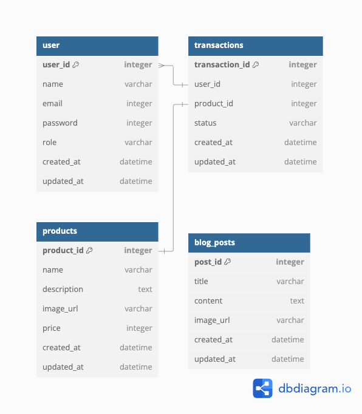

# Seruni Personal Website
Seruni is holistic healing practitioner. This personal website mixed with simple commerce to help sell her digital products which affiliated to her service, like e-books, workshop and video courses.

# Links
- Website/Frontend: [https://seruni-frontend.vercel.app/](https://seruni-frontend.vercel.app/)
    - Backend: [https://seruni-backend-production.up.railway.app/](https://seruni-backend-production.up.railway.app/)
- Repositories:
    - General: [https://github.com/hsoekiswo/seruni](https://github.com/hsoekiswo/seruni)
    - Frontend: [https://github.com/hsoekiswo/seruni-frontend](https://github.com/hsoekiswo/seruni-frontend)
    - Backend: [https://github.com/hsoekiswo/seruni-backend](https://github.com/hsoekiswo/seruni-backend)

**Inspiration**
- [Fellexandro Ruby Wabsite](https://fellexandroruby.com/product/15-tools-of-writing/)
- [Touch for Health Education](https://fellexandroruby.com/product/15-tools-of-writing/)
- [Menatar Bawah Sadar](https://menatarbawahsadar.id/collections/online-course)

# Features
- Home page
    - Short summary about Seruni
    - Product & blog highlight
- Product page
    - Image
    - Name
    - Price
    - Description
- Checkout page
    - Order summary

# Entitiy Relationsip Diagram

# Acomplishment & To do
## W4 January 2025
- Build frontend home, store, product, auth pages
- Implement authentication mechanism: login users can checkout
- Minimum styling frontend
- Deploy frontend & backend

## W1 February 2025
- Create API to read product, account
- Build frontend for blog and my account pages
- Set up SQLite as db
- Build frontend form to input product
- Data validation
- Improve product and checkout page to become dynamic

## W2 February 2025
- Create API to read and write transaction
- Create API to write and update product
- Research about how to deliver digital product (email/access on web/shared docs)
- API documentation
- Improve product highlight on home page to become dynamic

## W3 February 2025
- Build frontend for blog page
- Create API to read, write and update blog
- Improve blog page to become dynamic
- Improve blog highlight on home page to become dynamic